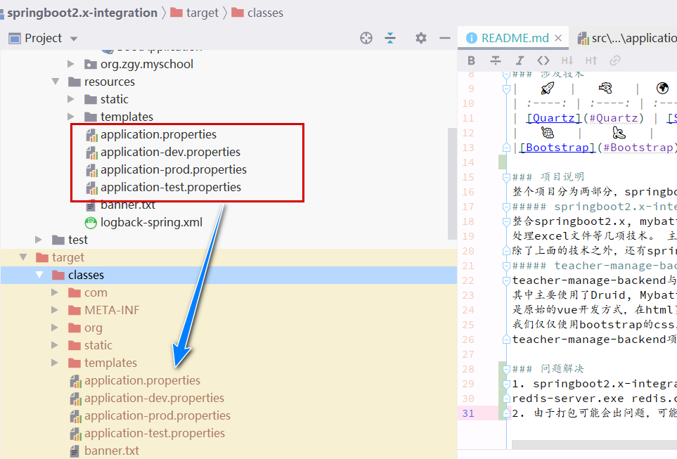

# springboot2.x-integration
[](https://img.shields.io/badge/%E6%9C%80%E5%85%89%E9%98%B4-%E8%B9%89%E8%B7%8E%E9%94%99%EF%BC%8C%E6%B6%88%E7%A3%A8%E8%BF%87%EF%BC%8C%E6%9C%80%E6%98%AF%E5%85%89%E9%98%B4%E5%8C%96%E6%B5%AE%E6%B2%AB-blue)
[](https://img.shields.io/github/issues/prayjourney/springboot2.x-integration)
[](https://img.shields.io/github/forks/prayjourney/springboot2.x-integration)
[](https://img.shields.io/github/stars/prayjourney/springboot2.x-integration)
[](https://img.shields.io/github/license/prayjourney/springboot2.x-integration)

### 涉及技术
|   🚀  |   🔫   |  🌍  |   🎃   |    📐  |   🌷   |   🎯   |   📚   |
| :----: | :----: | :----: | :----: | :----: | :----: | :----: | :----: | 
| [Quartz](#Quartz) | [Springboot](#Springboot) | [ElasticSearch](#ElasticSearch) | [Swagger](#Swagger) | [Kaptcha](#Kaptcha) | [Mybatis](#Mybatis) | [Shiro](#Shiro) | [Redis](#Redis) | 
|   🍇   |    🍌   |    🎫   |   🎁  |   ✨   |   ⚽    |       |       |
|[Bootstrap](#Bootstrap) | [axios](#axios) | [Vue](#Vue) | [Zipkin](#Zipkin) | [MongoDb](#MongoDb) | [Mysql](#Mysql) |

### 项目说明
整个项目分为两部分，springboot2.x-integration与teacher-manage-backend， 二者没有父子模块的关系。
##### springboot2.x-integration
整合springboot2.x, mybatis, mybatis plus, druid数据库连接池, shiro, elasticsearch, quartz, threadpool, 上传下载文件, 使用webuploader
进行**大文件上传**, 完成了上传于秒传功能, 使用easyexcel处理excel文件等几项技术。主要是对springboot之中常用的技术进行了一个整合，每个技术的使用可以参看
application.properties配置文件与config包之中查看除了上面的技术之外，还有spring-session技术，使用了logback作为日志记录。
使用了mysql与MongoDB存储，redis作为缓存。
##### teacher-manage-backend
teacher-manage-backend与springboot2.x-integration没有隶属的关系，teacher-manage-backend是教师管理系统的后台，作为一个后台系统，
其中主要使用了Druid, Mybatis， MybatisPlus技术， 主要是提供给前台增删改查的CRUD功能。 resources文件夹下的bootvue目录，bootvue目录，
是原始的vue开发方式，在html页面之中使用vue, 创建vue对象，然后进行数据和行为的绑定以及控制。使用了bootstrap的ui。在这一部分之中，
我们仅仅使用bootstrap的css，不使用他的js，js部分功能，由vue来实现。bootvue目录没有前后分离，只不过使用了vue技术的html页面。
teacher-manage-backend项目的前端部分，在该项目下的teacher-manage-front，基于vue2.x，启动的时候依次运行`npm install`, `npm run dev`启动。

### 问题解决
1. springboot2.x-integration项目启动， 需要首先启动redis, 否则就会报错， windows下，命令行下面启动redis-server.exe可能会报错，需要执行
redis-server.exe redis.conf，如`C:\work-soft\Redis-x64-3.2.100>redis-server.exe redis.conf`，后面的redis.conf是配置文件。
2. 由于打包可能会出问题，可能无法把两个项目之中的配置文件打包到运行其中，则需要手动拷贝，也就是target的classes目录下，如下图：

3. 打包问题的解决, 添加两个资源包， 一个是打包mapper.xml文件，一个是打包resources目录下的文件，这样两个就都能打包target的class或者jar包里了。
```xml
<build>
    <plugins>
        <plugin>
            <groupId>org.springframework.boot</groupId>
            <artifactId>spring-boot-maven-plugin</artifactId>
        </plugin>
    </plugins>
    <resources>
        <!-- mapper下面的xxx.xml文件要打包 -->
        <resource>
            <directory>src/main/java</directory>
            <includes>
                <include>**/*.xml</include>
            </includes>
        </resource>
        <!-- 包含resources文件夹以及子文件夹下所有资源 -->
        <resource>
            <directory>src/main/resources</directory>
            <includes>
                <include>**/*.*</include>
            </includes>
        </resource>
    </resources>
</build>
```
